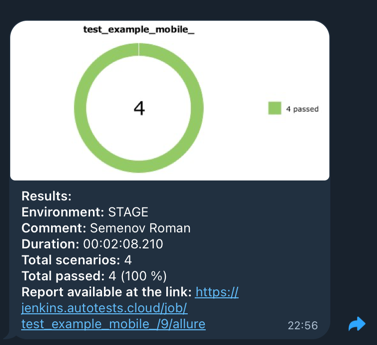

# Проект Mobile тестирования приложения Wikipedia

> Автоматизированное тестирование Android-приложения **Wikipedia Alpha** с использованием Appium и Selene.
> Поддерживается локальный запуск (реальное устройство / эмулятор) и удалённый запуск через **BrowserStack**.

---

## Используемые технологии

<p align="center">
  
  
  
  
  
  
  
  
</p>

| Технология | Назначение |
|---|---|
| **Python 3.10+** | Язык написания тестов |
| **pytest** | Фреймворк для запуска тестов и управления фикстурами |
| **Appium** | Драйвер для автоматизации Android-приложений |
| **Selene** | Высокоуровневая обёртка над Selenium/Appium с fluent API |
| **Allure** | Генерация читаемых HTML-отчётов с вложениями |
| **BrowserStack** | Облачная платформа для запуска тестов на реальных устройствах |
| **pydantic-settings** | Управление конфигурацией через `.env`-файлы |
| **Jenkins** | CI/CD: автоматический запуск тестов по расписанию и по коммиту |

---

## Покрытие тестами

### Mobile

| # | Тест | Статус |
|---|------|--------|
| 1 | Пропуск экрана онбординга | ✅ |
| 2 | Поиск возвращает результаты | ✅ |
| 3 | Первый результат поиска содержит поисковый запрос | ✅ |
| 4 | Открытие статьи из результатов поиска | ✅ |

---

## Структура проекта

```
qa_guru_mobile_python_git/
├── app/
│   └── wikipedia.apk          # APK-файл тестируемого приложения
├── screens/
│   ├── onboarding_screen.py   # Screen Object: экран онбординга
│   ├── search_screen.py       # Screen Object: экран поиска
│   └── article_screen.py      # Screen Object: экран статьи
├── tests/
│   ├── test_onboarding.py     # Тесты онбординга
│   ├── test_search.py         # Тесты поиска
│   └── test_article.py        # Тесты просмотра статей
├── config.py                  # Конфигурации (Local / BrowserStack) через pydantic
├── conftest.py                # Фикстуры: инициализация драйвера, Allure-вложения
├── pytest.ini                 # Настройки pytest / Allure
└── requirements.txt           # Зависимости проекта
```

---

## Конфигурация запуска

В проекте реализованы два профиля конфигурации через `pydantic-settings`:

| Профиль | Файл с переменными | Описание |
|---|---|---|
| `local` (по умолчанию) | `.env.local` | Реальное устройство или эмулятор через локальный Appium-сервер |
| `browserstack` | `.env.browserstack` | Удалённый запуск в облаке BrowserStack |

Профиль задаётся переменной окружения `CONTEXT`:

```bash
# Локальный запуск
python3 -m pytest tests/

# Удалённый запуск (BrowserStack)
CONTEXT=browserstack python3 -m pytest tests/
```

---

## Запуск проекта

### Требования

- Python 3.10+
- Appium Server (для локального запуска)
- Android-эмулятор или реальное устройство (для локального запуска)

### Установка зависимостей

```bash
pip install -r requirements.txt
```

### Локальный запуск

1. Запустите Appium Server: `appium`
2. Запустите эмулятор или подключите устройство
3. Укажите параметры в `.env.local`
4. Выполните:
   ```bash
   python3 -m pytest tests/ -v
   ```

### Удалённый запуск (BrowserStack)

1. Укажите учётные данные в `.env.browserstack`
2. Выполните:
   ```bash
   CONTEXT=browserstack python3 -m pytest tests/ -v
   ```

---

## Jenkins

[](https://jenkins.autotests.cloud/job/test_example_mobile_/)

Запуск тестов в Jenkins: [jenkins.autotests.cloud/job/test_example_mobile_/](https://jenkins.autotests.cloud/job/test_example_mobile_/)

---

## Allure Report

[](https://jenkins.autotests.cloud/job/test_example_mobile_/allure/)

После выполнения тестов генерируется Allure-отчёт:

```bash
allure serve allure-results
```

Каждый тест включает:
- **Скриншот** в конце теста
- **Видео** прохождения (при локальном запуске)
- **Видео из BrowserStack** (при удалённом запуске)
- Пошаговые шаги через `with allure.step()`

---

## Вложения в Allure

В `conftest.py` реализована следующая логика вложений:

| Вложение | Локально | BrowserStack |
|---|---|---|
| Скриншот (PNG) | ✅ | ✅ |
| Видео (MP4) | ✅ | ✅ (через API) |
| Ссылка на сессию | — | ✅ |


## Получение уведомлений о прохождении тестов в Telegram

